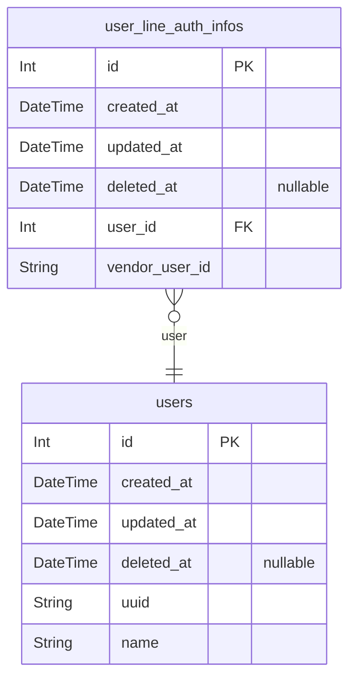

# Schema
> Generated by [`prisma-markdown`](https://github.com/samchon/prisma-markdown)

- [認証](#認証)

## 認証

### `user_line_auth_infos`
LINE認証情報

**Properties**
  - `id`: 
  - `created_at`: 
  - `updated_at`: 
  - `deleted_at`: 
  - `user_id`: 
  - `vendor_user_id`: ベンダーユーザーID

### `users`
ユーザー

**Properties**
  - `id`: 
  - `created_at`: 
  - `updated_at`: 
  - `deleted_at`: 
  - `uuid`: 外部公開ID
  - `name`: 名前